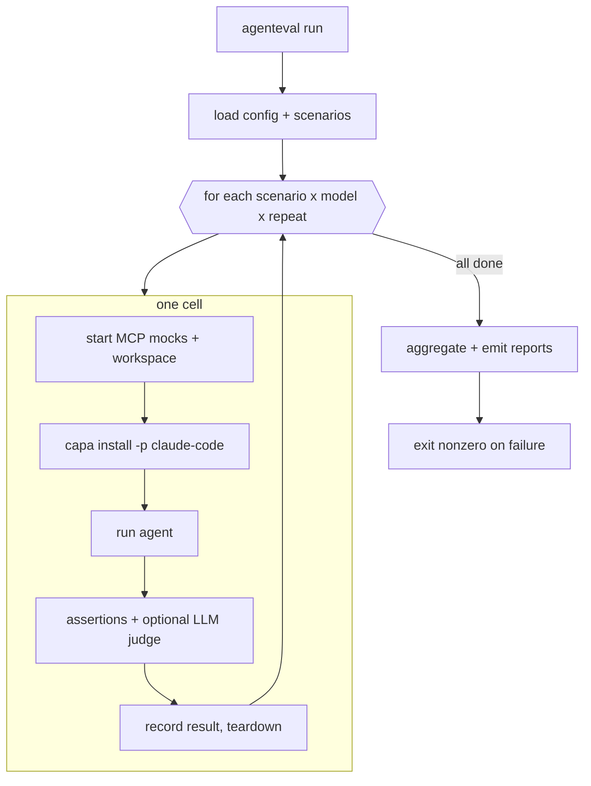

# agenteval: Unit Tests for AI Agents

[](https://pypi.org/project/agenteval-framework/)
[](https://github.com/Minitour/agenteval/actions/workflows/ci.yml)
[](https://pypi.org/project/agenteval-framework/)
[](LICENSE)

agenteval treats an agent run like a unit test. You declare the agent once with [capa](https://github.com/infragate/capa)'s `capabilities.yaml`, write scenarios (a prompt, fake MCP servers seeded with known state, and assertions), and run the whole suite from one CI-friendly command. Providers are pluggable, and Claude Code ships first.

## Why agenteval?

Testing an AI agent is awkward. It calls real SaaS APIs, burns tokens on every run, and answers a little differently each time. So most agent "tests" are a human eyeballing the output once and calling it good. There is no red/green, nothing to gate a PR on, nothing that tells you a prompt edit quietly broke the Slack integration.

agenteval gives you the parts that are tedious to build yourself. You declare the agent once in `capabilities.yaml`, then write scenarios next to it: a prompt, a set of mock MCP servers seeded with state you control, and assertions about what should happen. Each run gets its own throwaway workspace, talks only to local mocks, and is checked against those assertions. The mocks record every tool call, so you can assert the agent posted to `#releases` exactly once, or never touched a `delete_user` tool at all.

One command runs the whole matrix of scenarios, models, and repeats, aggregates the results, and exits nonzero when something regresses. JUnit XML drops straight into CI.

## What it does

* MCP mock infrastructure: stand up fake MCP servers from a `mock.yaml` with verbatim tool schemas, seed state, declarative responses, and an optional Python escape hatch for stateful tools.
* Every tool call is recorded, so assertions can check what the agent did, not just what it said.
* Ephemeral workspace per run, `capa install` to compile `capabilities.yaml` into provider config, the agent invocation, repeats, and result aggregation.
* Declarative assertions (`mock_state`, `tool_called`, file and output checks) plus an optional LLM judge scored against a rubric.
* Reports as JSON, JUnit XML for native CI gating, markdown for PR comments, and a console summary.
* Pluggable providers: a new harness is a `Provider` subclass that picks a different `capa install -p` target, with no changes to the runner.

## How it works

For every `(scenario, model, repeat)` cell, agenteval builds an isolated environment, lets capa bootstrap the agent, runs it against local mocks, then checks the side effects. The mocks start before install so capa can validate tools against a live server.



The framework owns the workspace, the mocks, and the URL rewiring that connects them; it delegates all harness provisioning to `capa install -p <provider>`.

## Installation

```bash
pip install agenteval-framework
```

Or install it as an isolated CLI tool with [uv](https://docs.astral.sh/uv/):

```bash
uv tool install agenteval-framework
```

The distribution is `agenteval-framework`; the import package and the CLI are both `agenteval`.

Prerequisites (external, documented by their projects):

* The `capa` binary on PATH. agenteval uses it to compile `capabilities.yaml`.
* The provider CLI. For Claude that is the `claude` CLI (Claude Code), authenticated via subscription or `ANTHROPIC_API_KEY`.

## Quick start

### 1. Scaffold a project

```bash
agenteval init my-eval
cd my-eval
```

This drops an `agenteval.yaml`, an agent, and one example scenario next to your code.

You can also optionally install the `agenteval` skill to let your agent author tests:
```bash
capa add Minitour/agenteval@agenteval
```

### 2. Add your credentials

```bash
cp .env.example .env        # add ANTHROPIC_API_KEY if your CLI needs it
```

### 3. Validate and run

```bash
agenteval validate          # structural check, no model calls
agenteval run -v            # run the suite
```

Or run the bundled, fully working example:

```bash
agenteval run --root examples/my-eval -v
```

Expected shape of the output:

```
  scenario 'slack-release-note'  provider=claude  model=claude-opus-4-8
    trial 1/1: PASS  $0.1783  turns=4  13.2s  judge=1.00
  suite: 1/1 runs passed  ->  PASS
```

## Project layout

```
my-eval/
  agenteval.yaml              # provider, models, defaults, judge, report config
  .env                        # ANTHROPIC_API_KEY etc (you bring; never committed)
  agents/
    release-bot/
      capabilities.yaml       # capa spec -> provider config
      CLAUDE.md               # agent base prompt (referenced by capabilities.yaml)
      skills/slack/SKILL.md   # local skills (optional)
  scenarios/
    slack-release-note/
      scenario.yaml           # agent ref, prompt, mcp list, assertions, judge
      input/prompt.md         # the task prompt
      rubric.md               # LLM-judge rubric (optional)
      assets/                 # files copied into the ephemeral workspace (optional)
      mcp/
        slack/
          mock.yaml           # schema ref + seed state + declarative responses
          schema.json         # verbatim tools/list (optional; can inline)
          handler.py          # optional Python hooks for stateful tools
  reports/                    # output (gitignored)
```

## Defining a scenario

`scenario.yaml`:

```yaml
id: slack-release-note
agent: release-bot
prompt_file: input/prompt.md
mcp: [slack]                  # which mocks (dirs under mcp/) to start

run:
  repeats: 1
  max_turns: 15

assertions:
- kind: mock_state            # a message landed in #releases
  server: slack
  jsonpath: "$.messages[?(@.channel_name=='releases')]"
  min_count: 1
- kind: tool_called           # the agent actually posted
  server: slack
  tool: slack_send_message
  min_count: 1

judge:
  rubric_file: rubric.md      # LLM-judged message quality
  min_score: 0.6
```

### Assertion kinds

| kind | params | checks |
|---|---|---|
| `mock_state` | `server`, `jsonpath`, `min_count`, `max_count` | JSONPath matches against a mock's final state |
| `tool_called` | `tool`, `server`, `min_count`, `max_count` | a tool was (or was never, with `max_count: 0`) called |
| `file_exists` | `path` | a file exists in the workspace |
| `file_contains` | `path`, `values`, `mode` | file contains all/any of `values` |
| `dir_has_new_file` | `path`, `matches`, `contents_include` | a matching file with given content exists |
| `output_contains` | `values`, `mode`, `ignore_case` | final answer contains all/any of `values` |
| `output_matches` | `pattern`, `ignore_case` | final answer matches a regex |

Each assertion is `required: true` by default; a required failure fails the run and sets a nonzero exit code. The `jsonpath` for `mock_state` supports the Goessner filter form (`$.coll[?(@.field=='value')]`) and plain paths natively, and falls back to `jsonpath-ng` for richer expressions.

## Defining a mock

`mcp/<server>/mock.yaml` is hybrid: declarative by default, with a Python escape hatch for stateful behaviour.

```yaml
name: slack
schema: schema.json          # verbatim tools/list, or inline `tools:`
handler: handler.py          # optional; functions override named tools

seed:                        # initial state, reset before every run
  channels:
  - { id: C1, name: releases }
  messages: []

responses:                   # declarative dispatch (used when no handler matches)
  list_channels:
    result: { ok: true, channels: "{{ state.channels }}" }
  post_message:
    mutate:
    - append: { path: messages, value: { channel_name: releases, text: "{{ args.text }}" } }
    result: { ok: true, ts: "{{ now }}" }
```

Templating is Jinja2 over `{ args, state, now, uuid }`. A value that is a single `{{ expr }}` keeps its native JSON type. Mutations support `append`, `extend`, `set`, and `increment`. A `handler.py` may export a `HANDLERS` dict (or `tool_<name>` functions); each handler is `fn(args, ctx)` and mutates `ctx.state.data`.

## CLI

```
agenteval run        run the suite, emit reports, exit nonzero on failure
agenteval list       list discovered scenarios
agenteval validate   check structure without calling any model
agenteval init       scaffold a new eval project
```

`run` flags: `--root`, `--filter <substr>`, `--provider`, `--model` (repeatable), `--repeat N`, `--report-dir`, `--no-judge`, `--keep-workspace`, `-v`.

## Reports

`agenteval run` writes to `report.dir` (default `reports/`):

* `results.json`: full per-run records plus per-cell aggregates (mean/stddev/median per metric, pass rate, judge score).
* `junit.xml`: one testcase per repeat, for native CI gating.
* `report.md`: a table plus a failure breakdown for PR comments.

The judge defaults to the `claude-cli` backend, which reuses the Claude Code CLI's auth (so it works without exporting `ANTHROPIC_API_KEY`). Set `judge.backend: anthropic-api` in `agenteval.yaml` to use the Anthropic SDK with `ANTHROPIC_API_KEY` instead.

## CI

Templates are included for both GitHub Actions ([`examples/my-eval/.github/workflows/agenteval.yml`](examples/my-eval/.github/workflows/agenteval.yml)) and GitLab CI ([`examples/my-eval/.gitlab-ci.yml`](examples/my-eval/.gitlab-ci.yml)). Copy the one you need to your repo root, provide `ANTHROPIC_API_KEY` as a secret/variable, install `capa` and the `claude` CLI, then run `agenteval run`. The nonzero exit on failure gates the merge request; both templates upload `reports/` as an artifact and publish `junit.xml` for native test reporting.

## Adding a provider

Subclass `agenteval.providers.base.Provider` (implement `install`, `run`, `preflight`), then register it:

```python
from agenteval.providers.registry import register
register(MyProvider)
```

`install` rewrites the `servers:` URLs in `capabilities.yaml` to the local mock endpoints and compiles them for the target harness; `run` invokes the agent and returns a normalized `ProviderRunOutput`. No core changes required.

## Contributing

See [CONTRIBUTING.md](CONTRIBUTING.md). Security reports go through [SECURITY.md](SECURITY.md).

## License

MIT
